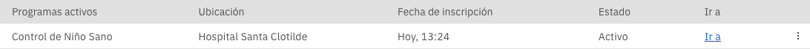
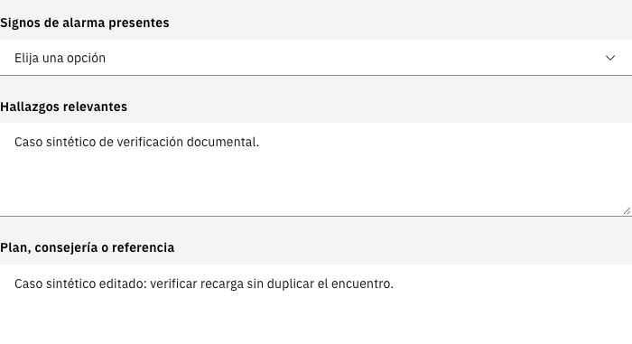

# Crecimiento y desarrollo

Esta guía explica cómo registrar y revisar una atención en CRED. Describe las
pantallas observadas el 7 de octubre de 2026 con un paciente ficticio. Está
pendiente de revisión funcional, clínica y de privacidad.

## Antes de registrar

1. Abra la historia del niño y confirme su identidad, fecha de nacimiento y sexo.
2. Confirme que corresponde registrar la atención y que la consulta está activa.
3. Revise los antecedentes y los registros disponibles. Un espacio vacío no
   demuestra que una evaluación se haya realizado ni que su resultado sea normal.
4. Use las opciones habilitadas para su perfil. Si falta una opción, solicite
   ayuda al responsable de SIHSALUS del establecimiento.

## Entrar al componente

1. Abra **Programas** en la historia del paciente.
2. Revise si existe una inscripción activa en **Control de Niño Sano**.
3. Si corresponde inscribirlo y su perfil lo permite, use **Registrar
   inscripciones a programas** o **Agregar**. Seleccione el programa, compruebe
   la fecha y la ubicación de inscripción y pulse **Guardar y cerrar**.
4. Compruebe que el programa aparezca como **Activo**. Use **Ir a** en esa fila
   para abrir CRED. La inscripción también habilita el grupo **Curso de Vida
   del Niño** en el menú de la historia.

No cree otra inscripción para sustituir una que todavía no aparece después de
guardar. Recargue la historia y revise el resultado antes de repetir la acción.

*Ejemplo sintético de la inscripción activa y del acceso a CRED desde Programas.*

## Orientarse en los paneles

El grupo **Curso de Vida del Niño** reúne cinco entradas. La disponibilidad de
sus acciones depende de la consulta, los registros y el perfil de atención.

| Entrada del menú | Pestañas que se pueden consultar |
| --- | --- |
| Curso de Vida del Niño | Signos vitales del recién nacido; Registro perinatal; Atención inmediata; Evaluación cefalocaudal; Alojamiento conjunto; Lactancia |
| Control de Niño Sano | Seguimiento; Controles CRED; Desarrollo; Servicios adicionales |
| Esquema de Vacunación Infantil | Calendario de vacunación; Reacciones Adversas |
| Estimulación Temprana | Sesiones de estimulación; Seguimiento de estimulación; Consejería de estimulación |
| Nutrición Infantil | Evaluación nutricional; Consejería alimentaria; Seguimiento nutricional |

En la primera entrada, el encabezado del panel es **Atención Neonatal**. Las
pestañas permiten consultar diferentes registros sin cambiar de paciente.

## Preparar el primer control del recién nacido

1. Abra **Curso de Vida del Niño → Registro perinatal**.
2. Revise **Embarazo y Parto**. Para crear el registro, pulse **Registrar
   embarazo y parto**; para revisar uno existente, use **Editar**.
3. Compruebe el **Lugar del Parto** en el registro correspondiente.
4. Revise **Datos del Nacimiento**. Para un parto institucional, el inicio del
   primer control requiere la **Fecha y hora de alta del recién nacido**.
5. Complete los campos requeridos del formulario y los datos del responsable
   de la atención. Pulse **Guardar** y compruebe el resumen.

Si aparece el aviso que solicita lugar del parto o alta, complete el registro
correspondiente antes de volver al control. No cambie la fecha de nacimiento
para evitar el aviso.

### Comprobación de la hora de alta pendiente

En la prueba documental se observó una diferencia entre la hora ingresada
y la mostrada en el resumen del alta. Esta parte del flujo requiere
corrección y nueva verificación. Si encuentra una diferencia, conserve los
datos originales y comuníquelo al responsable; no compense la hora por su
cuenta ni dé por validado el registro.

## Registrar un control CRED

1. Abra **Control de Niño Sano** y consulte **Seguimiento** y **Controles CRED**.
2. Abra la herramienta **Formularios Crecimiento y Desarrollo** de la historia.
3. Revise la fecha y la hora de inicio, la fecha del último control, el número
   de control y el grupo etario calculados por el sistema.
4. Si los datos son correctos y no hay avisos pendientes, pulse **Empezar Control**.
5. En **Selección de Formularios Crecimiento y Desarrollo**, abra el formulario
   que corresponde a la atención realizada. Puede usar la búsqueda de la lista.
6. Complete sus campos requeridos y compruebe los datos del responsable.
7. Pulse **Guardar** dentro del formulario. Espere el resultado del guardado y
   compruebe la fecha en **Última Vez Completado** al regresar al selector.
8. Complete y compruebe cada formulario que corresponda. La lista disponible
   cambia según la edad y el perfil; la presencia de un formulario no implica
   que todos deban completarse en cada atención.
9. Después de comprobar los formularios, use **Guardar y Firmar** para terminar
   el selector. Ese rótulo por sí solo no acredita una firma digital certificada.
10. Regrese a **Controles CRED**, recargue la historia y compruebe que el control
    y sus registros continúen disponibles antes de finalizar la consulta.

*Ejemplo sintético: los textos de hallazgos y plan se conservaron al volver a
abrir el examen físico después de recargar la historia. No es una indicación
asistencial.*

## Revisar o corregir un registro

Abra el registro existente mediante **Editar** o desde el formulario del mismo
control. Revise su fecha y contexto antes de cambiarlo. Guarde la corrección,
vuelva a abrir el registro y compruebe que conserva los demás campos.

En la prueba documental se creó y editó un examen físico, se recargó la historia
y se comprobó la conservación del registro sin crear otro encuentro. Esto no
acredita el funcionamiento de todos los formularios ni de todos los perfiles.

**Cancelar** dentro de un formulario descarta sus cambios sin guardar.
Cancelar o cerrar el selector después de haber guardado un formulario no debe
interpretarse como eliminación de ese registro: revise la historia.

## Seguimiento y problemas de registro

- Consulte el historial y la propuesta del próximo control. Compruebe cualquier
  cita en el flujo de citas del establecimiento; ver una fecha propuesta no
  demuestra que una cita haya sido registrada.
- Revise la evidencia de tamizajes y suplementación en sus registros. En la
  prueba, un panel vacío de suplementación mostró **En curso**; esa etiqueta
  requiere revisión y no acredita una prescripción ni una entrega.
- Si el guardado falla o queda incierto, conserve el formulario y revise el
  historial antes de volver a registrar. No duplique la atención.
- Si aparecen campos o registros de otro paciente, detenga el registro y avise
  al responsable del establecimiento sin compartir datos de pacientes por
  canales públicos.

Las decisiones de evaluación, vacunación, suplementación y referencia siguen
los protocolos vigentes y el criterio del profesional responsable. Esta guía
no contiene dosis, umbrales clínicos ni instrumentos completos de terceros.

Consulte también [Consulta externa](consulta-externa.md) y el
[Proceso de atención CRED](proceso-cred.md).
